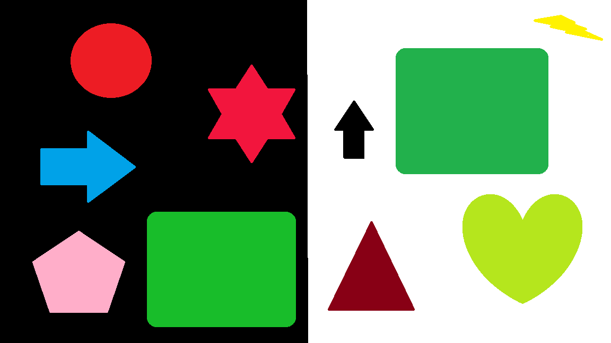
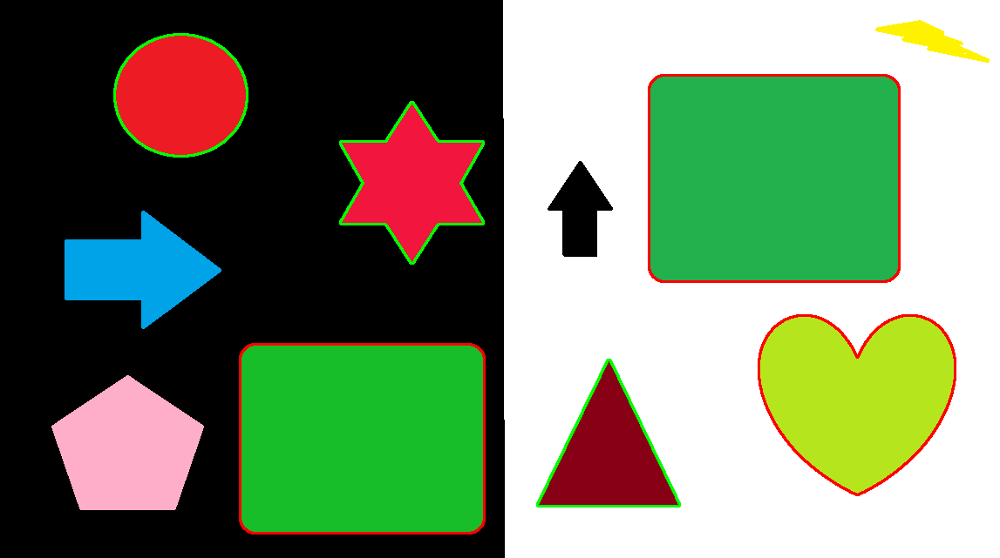

# Red and Green Object Detection

## Project Overview
This Python project leverages OpenCV to detect and highlight red and green objects within images. The program adjusts for various shades of red and green to ensure robust detection even in varying lighting conditions. This is particularly useful in applications such as automated sorting systems, quality control in manufacturing, or any scenario where color differentiation is crucial.

## Features
- **Robust Color Detection:** Adjusted HSV thresholds to capture a wide range of shades for red and green colors.
- **Contour Highlighting:** Detects and outlines the contours of red and green objects in images.
- **Filtering Small Objects:** Ignores small objects that may be noise or irrelevant to the analysis.

## Technologies Used
- Python 3
- OpenCV
- NumPy

## Installation
Make sure you have Python installed on your system. You can then install OpenCV and NumPy using pip:

```bash
pip install opencv-python-headless numpy
```

## Usage
1. Place the image you want to process in the `assets` folder.
2. Update the `image_path` variable in the script to reflect the name of your image file.
3. Run the script:
   ```bash
   python red_green_detection.py
   ```

## Example
After running the script, the image will display with red and green objects outlined. Here's a quick breakdown of the script's flow:
- **Image Loading:** Load an image from a specified path.
- **HSV Conversion:** Convert the image from BGR to HSV color space.
- **Color Thresholding:** Apply thresholds to isolate red and green colors.
- **Contour Detection and Drawing:** Detect contours of these colors and draw them on the original image.
- **Display Results:** Show the processed image with highlighted objects.


## Contributing
Pull requests are welcome. For major changes, please open an issue first to discuss what you would like to change.

## License
This project is licensed under the MIT License - see the [LICENSE.md](LICENSE) file for details.

## Authors
- Mohamed Hamed


## Test Result

Red objects are highlighted in green and Green objects are highlighted in red

